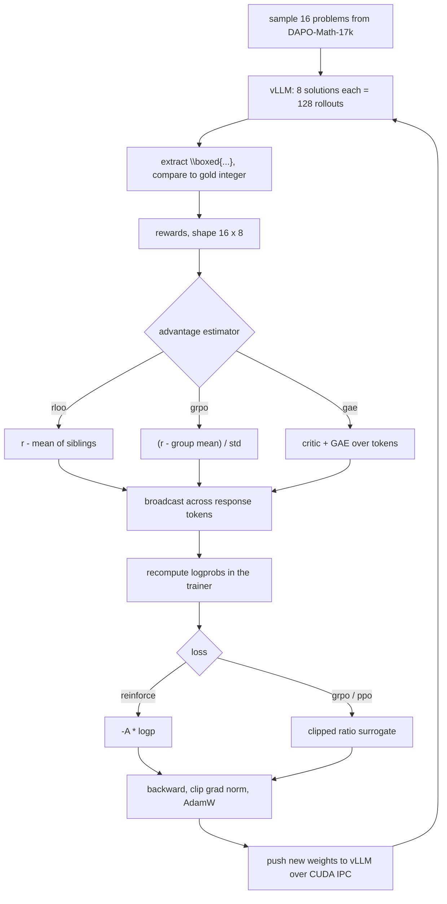

# RL from Scratch: REINFORCE, GRPO and PPO on Qwen3.5

A working, annotated implementation of three policy-gradient algorithms over one
shared rollout stack, trained on competition math with a verifiable reward.

Nothing here uses TRL, verl, or any other RL trainer. The advantage estimators,
losses, batching and training loop are all in this repo, in about 1,500 lines, so
you can read the whole thing.

---

## 1. The core idea in one page

We have a language model (the *policy*) that writes a solution to a math problem.
We can check whether the final answer is right. We want to make the model more
likely to produce solutions that are right.

The policy gradient theorem says: to increase expected reward, nudge the log
probability of each action up in proportion to how good that action turned out.

$$\nabla J = \mathbb{E}\left[ A \cdot \nabla \log \pi(a \mid s) \right]$$

Here one "action" is a whole generated solution, and $A$ (the *advantage*) says how
much better than expected that solution was. Every algorithm below is a different
answer to two questions:

1. **How do we estimate $A$?** &rarr; [`advantages.py`](src/llm_rl/advantages.py)
2. **What objective do we actually descend?** &rarr; [`losses.py`](src/llm_rl/losses.py)

Everything else -- sampling, reward checking, tokenization, log-probability
recomputation, the optimizer -- is identical across all three. That is deliberate:
it is the only way a comparison between them means anything.

---

## 2. Why an advantage and not just the reward

Suppose reward is 1 for a correct answer and 0 for a wrong one, and the model is
right 20% of the time. If we use the raw reward as the advantage, then:

- correct solutions get their log-probability pushed **up**
- wrong solutions get pushed by exactly **zero**

Nothing is ever pushed down, and the size of every update depends on how often the
model happens to be right, which changes as training proceeds. It works, but the
variance is high and the scale drifts.

Now subtract a *baseline* -- roughly, the average reward you expected on this
problem. Correct solutions get a positive advantage, wrong ones negative. The
update becomes "do more of what beat expectations, less of what missed," which is
both lower variance and self-normalizing.

Critically, subtracting a baseline that does not depend on the action you took
leaves the gradient unbiased. That single fact is what all three algorithms exploit,
and they differ mainly in where the baseline comes from.

> **Run `nobaseline` to see this.** It is the same REINFORCE loop with
> `advantage: raw`, i.e. no baseline at all. Compare its gradient norm and accuracy
> curve against `reinforce_s0`.

---

## 3. The three algorithms

### 3.1 REINFORCE with a leave-one-out baseline (RLOO)

Sample $G$ solutions for the same problem. For solution $i$, use the mean reward of
its *siblings* as the baseline:

$$A_i = r_i - \frac{1}{G-1}\sum_{j \neq i} r_j$$

Excluding $i$ from its own baseline is what keeps the estimator unbiased. It costs
nothing extra -- we already sampled the group.

```python
# src/llm_rl/advantages.py
total = rewards.sum(dim=-1, keepdim=True)
baseline = (total - rewards) / (group_size - 1)
return rewards - baseline
```

No critic, no ratio, no clipping. The catch: it is valid **only on-policy**. The
moment you take a second gradient step on the same batch, the data no longer comes
from the current policy and the estimator is wrong. `configs/reinforce.yaml` pins
`ppo_epochs: 1` and [`algos/reinforce.py`](src/llm_rl/algos/reinforce.py) raises if
you change it.

### 3.2 GRPO

Same trick, two changes. The baseline is the plain group mean (including $i$), and
the objective is PPO's clipped ratio so a batch can be reused:

$$A_i = \frac{r_i - \mathrm{mean}(r)}{\mathrm{std}(r)}$$

The std division is the part people argue about. Dividing by a small std inflates
advantages for groups where the model was consistent, which up-weights easy and
already-solved problems. Dr.GRPO and DAPO drop it. Both are available:

| | original GRPO | Dr.GRPO / DAPO |
|---|---|---|
| `normalize_advantage_std` | `true` | `false` |
| `loss_normalization` | `sequence` | `token` |

The second row matters more than it looks. `sequence` averages the loss within each
sequence and then across sequences, so a 50-token answer counts as much as a
2000-token one, which biases the model's length behaviour. `token` divides by the
total token count in the batch instead.

```python
# src/llm_rl/losses.py -- the choice is one branch
if mode == "token":
    return (values * mask).sum() / mask.sum()          # every token equal
if mode == "sequence":
    per_seq = (values * mask).sum(-1) / mask.sum(-1)   # every sequence equal
    return per_seq.mean()
```

> **Run `grpo_orig` vs `grpo_s0` to see this.** Same algorithm, same seed, only
> those two flags differ. Watch the response-length panel especially.

**Clip-higher.** DAPO's observation: with a symmetric clip range, a token that
currently has low probability can barely be reinforced, because $1.2 \times$ a tiny
number is still tiny, while the downside is unbounded. Raising only the upper clip
(`clip_ratio_high: 0.28` vs `clip_ratio_low: 0.2`) leaves more room to promote rare
tokens and measurably delays entropy collapse.

**Dynamic sampling.** If all $G$ samples in a group get the same reward, the group
mean equals every element, so every advantage is exactly zero and the group
contributes nothing but padding. DAPO drops those groups
(`nonzero_variance_groups` in [`advantages.py`](src/llm_rl/advantages.py)).

### 3.3 PPO

The only one with a learned critic. A linear head on the shared backbone predicts
the return at every token, and GAE turns the single end-of-sequence reward into a
per-token advantage:

$$\delta_t = r_t + \gamma V(s_{t+1}) - V(s_t), \qquad A_t = \sum_{l} (\gamma\lambda)^l \delta_{t+l}$$

This is the one real capability the group methods lack: **credit assignment inside a
sequence**. RLOO and GRPO broadcast one scalar across all 2000 tokens of a solution,
so a brilliant first step and a careless arithmetic slip at the end receive the same
credit. PPO can in principle distinguish them.

In practice it often loses on tasks like this one, because the critic has to learn a
value function from a single sparse binary signal at the very end of a long
sequence. That is a hard regression problem, and a bad critic produces advantages
that are worse than no critic at all. Watch `value/explained_variance` in the logs:
if it stays near zero, the critic never learned anything and PPO is effectively
running on noise.

#### That is exactly what happened here

PPO destabilized in every configuration tried, while the group methods trained
cleanly with identical settings. The archived attempts are in `runs_archive/`, and
the progression is worth reading because each fix was real and each was insufficient:

| attempt | change | outcome |
|---|---|---|
| 1 | as originally written | collapsed by step ~12. Critic init emitted values ~3 against rewards in {0,1}; gradient norm 153 |
| 2 | zero-init critic, whitened advantages | value loss 5.0 &rarr; 0.2, grad norm 153 &rarr; 15, but collapsed by ~step 20 |
| 3 | critic trained on detached hidden states | policy no longer corrupted through the backbone, still collapsed |
| 4 | separate gradient clipping for policy and critic | policy grad norm 25 &rarr; 1-5, still collapsed |

Each fix addressed something genuinely wrong. None addressed the actual problem,
which the metrics state plainly: **`value/explained_variance` sat between -2 and -9
throughout**. Negative explained variance means the critic is a worse predictor of
the return than simply guessing the mean. Every token-level advantage it produced
was noise.

The failure is then mechanical. Noisy per-token advantages slightly discourage
emitting EOS, responses lengthen, more of them hit the 4096-token cap, truncated
sequences get masked out of the loss, the effective batch shrinks, and eventually
every rollout is truncated and the gradient is exactly zero. You can watch it happen
in the logs: `len` climbs to 4096, `trunc` to 100%, then `grad_norm` to 0.

The group methods are structurally immune to this. When every sample in a group gets
the same reward, the group baseline makes every advantage *exactly* zero and no
update happens. A critic, by contrast, always has an opinion, and when it is wrong
that opinion is indistinguishable from signal. On sparse binary rewards over long
sequences, having no value function is not a limitation -- it is the feature.

This is a large part of why GRPO and RLOO displaced PPO for verifiable-reward
LLM training.

---

## 4. What actually happens in one training step



Read it in [`trainer.py::train_step`](src/llm_rl/trainer.py). The loop is about 40
lines; the rest of the file is batching and bookkeeping.

---

## 5. Five things that are easy to get wrong

These are not hypothetical. Each one was hit and fixed while building this, and each
would have silently produced garbage.

### 5.1 bf16 parameters make small updates vanish

bf16 has an 8-bit mantissa, so near a typical weight of 0.02 the smallest
representable change is about 1.6e-4. An Adam step at `lr=1e-6` moves a weight by
about 1e-6. It gets rounded away.

Measured on this model (`scripts/_check_update_precision.py`):

| parameter dtype | lr | weights that actually moved | mean update |
|---|---|---|---|
| bfloat16 | 1e-6 | **2.0%** | 2.8e-07 (expected 1e-05) |
| float32 | 1e-6 | 100% | 1.0e-05 |

So parameters are fp32 and compute runs under bf16 autocast. Weights are cast back
to bf16 only when syncing to the inference engine.

### 5.2 The vocabulary, not the depth, sets your memory ceiling

Qwen3.5's vocabulary is 248,320 tokens. Logits for a batch of 32k tokens are
248320 x 32768 x 4 bytes = **32 GB in fp32**, and autograd holds them until backward.

The fix is to apply the LM head to a slice of tokens at a time inside a checkpointed
region, so only one slice's logits exist at once
([`logprobs.py`](src/llm_rl/logprobs.py)). Measured on the 0.8B model:

| tokens | chunked | unchunked |
|---|---|---|
| 4,096 | 3.8 GiB | 13.3 GiB |
| 16,384 | 5.3 GiB | 48.0 GiB |
| 32,768 | **8.0 GiB** | 94.4 GiB |

Time cost: 0.88s vs 0.85s. Essentially free.

### 5.3 Never trust the sampler's log-probabilities

vLLM and HuggingFace do not produce bit-identical logprobs -- different kernels,
different reduction orders, bf16 rounding. Measured here: correlation 0.9999, but
worst-case token difference 0.159, which is an importance ratio of 1.14 on a
quantity that is supposed to start at exactly 1.0.

Feed that into a clipped objective and you have a spurious 14% ratio before the
policy has changed at all. So the trainer **recomputes** old logprobs with its own
forward pass and only uses vLLM's tokens, never its probabilities.

### 5.4 Pad on the right, not the left

Qwen3.5 is a hybrid: 18 of its 24 layers are Gated DeltaNet (linear attention) with
a recurrent state that scans left to right, and only layers 3, 7, 11, 15, 19 and 23
are full attention. Left-padding would push pad tokens through that recurrence
*before* the real content. Right-padding puts them after the response, where
everything is masked out anyway.

### 5.5 A truncated rollout is not a wrong answer

If generation hits the token limit, there is no final answer to grade. Scoring it as
incorrect teaches the model that whatever it was doing was bad, when the real
problem is that it did not finish. Worse, a `\boxed{}` from earlier scratch work
might be scored as if it were the answer.

Truncated sequences are therefore masked out of the loss (`mask_truncated`), and
`rewards.score` refuses to mark a truncated rollout correct. This matters a lot
here: the 4B base model truncates on 43-53% of DAPO problems.

---

## 6. Reading the results

```bash
python scripts/report.py            # summary table
python scripts/report.py --plot     # writes runs/comparison.png
python scripts/report.py --watch    # live refresh
```

The runs:

| run | what it isolates |
|---|---|
| `reinforce_s0`, `reinforce_s1` | RLOO baseline, no ratio, no critic |
| `grpo_s0`, `grpo_s1` | group baseline + clipped ratio (Dr.GRPO flavour) |
| `ppo_s0`, `ppo_s1` | learned critic + token-level GAE |
| `grpo_orig` | vs `grpo_s0`: does std-norm + per-sequence loss matter? |
| `nobaseline` | vs `reinforce_s0`: what is a baseline worth? |

Two seeds per algorithm exist so you can tell a real difference from noise. If the
gap between two algorithms is smaller than the gap between their two seeds, you have
not measured anything.

**What to look at, roughly in order of usefulness:**

- `reward/accuracy` -- fraction of rollouts correct. The primary curve. It is
  measured on the training distribution, so it moves much faster than AIME.
- `reward/format_rate` -- how often the model emits a parseable `\boxed{}`. Expect
  this to rise first; formatting is the easiest thing for RL to fix.
- `rollout/truncated_frac` and `response_len_mean` -- length dynamics. This is where
  `loss_normalization` shows its effect.
- `policy/clip_frac` -- fraction of tokens hitting the trust region. Persistently
  high means the policy is trying to move faster than PPO allows.
- `value/explained_variance` (PPO only) -- near zero means the critic is useless.
- The `eval` records -- avg@k on AIME 2024 and MATH-500.

### What the overnight run actually produced

Eight runs, one per GPU, 6.5 hours each on Qwen3.5-4B-Base. Peak held-out avg@4
against the untrained baseline:

| run | AIME 2024 peak | at step | final | MATH-500 peak | final |
|---|---|---|---|---|---|
| baseline | 17.9% | - | - | 69.2% | - |
| `reinforce_s0` | 30.8% | 49 | 14.2% | 90.8% | 74.2% |
| `reinforce_s1` | 34.2% | 49 | 20.0% | 87.5% | 84.2% |
| `grpo_s0` | 37.5% | 99 | 15.8% | 88.3% | 73.3% |
| `grpo_s1` | 38.3% | 249 | 24.2% | 90.8% | 84.2% |
| `grpo_orig` | **41.7%** | 49 | 15.0% | 90.8% | 75.8% |
| `nobaseline` | 38.3% | 49 | 22.5% | 83.3% | 70.8% |
| `ppo_s0` | 2.5% | 29 | 0.0% | 65.0% | 10.8% |
| `ppo_s1` | 0.0% | 29 | 0.0% | 50.0% | 0.0% |

Four things worth taking from this, stated at the confidence the data supports.

**1. RL works, and quickly.** Every non-PPO run roughly doubled AIME accuracy within
50-100 steps, and MATH-500 rose from 69% to ~90%. Training accuracy on DAPO-Math
went from ~27% to ~57% in the first 64 steps.

**2. Everything then over-optimizes.** All six healthy runs peaked early and declined
afterwards, some back below baseline. Training reward stayed high while held-out
accuracy fell, which is the signature of the policy drifting somewhere that satisfies
the reward without generalizing. The cause is straightforward: these runs used
`kl_coef: 0`, so nothing anchored the policy to the base model. **The most useful
next experiment on this codebase is to set `kl_coef` to something like 0.001-0.01
and see whether the peak is sustained.** Early stopping on a held-out set would also
have captured most of the available gain.

**3. No reliable ranking among REINFORCE, GRPO, and no-baseline.** The two seeds of a
single algorithm differ by as much as the algorithms differ from each other
(`grpo_s0` finished at 15.8% and `grpo_s1` at 24.2% on identical settings). With 30
AIME problems at k=4, one problem is 0.8 percentage points and the noise floor is
high. Anyone claiming a winner from this data is reading noise.

The honest summary: GRPO variants reached the highest peaks, and `grpo_s1` held its
gains best, but the evidence does not separate them from RLOO.

**4. The no-baseline control did not fail, and that is informative.** It was expected
to be clearly worse. It was not -- it reached the fastest early training gains
(+25.8% over 64 steps) and the highest format rate (87%) with the lowest truncation
(13%).

There is a good reason. With binary rewards, the raw-reward advantage is 1 for
correct rollouts and 0 for everything else, so only correct solutions ever receive
gradient. That is not really vanilla policy gradient any more; it is iterative
rejection-sampling fine-tuning (STaR / RAFT), which is a legitimate method that
works. What it cannot do is push probability *away* from bad behaviour, only toward
good behaviour. Its advantage disappears when rewards are dense or signed.

**5. PPO failed in every configuration** -- see section 3.3 above for the four
attempts and the diagnosis.

### A caution about AIME

Measured baselines at temperature 0.6:

| | 0.8B avg@8 | 4B avg@8 | 4B pass@8 |
|---|---|---|---|
| AIME 2024 | 0.00% | 17.92% | 33.33% |
| AIME 2025 | 0.42% | 13.33% | 26.67% |
| AIME 2026 | 0.00% | 12.08% | 23.33% |
| MATH-500 | 36.67% (k=4) | 69.17% | 93.33% |
| GSM8K | 48.33% (k=4) | 81.25% | 100.00% |

We train the 4B model, and the reason is visible above. At 0.8B, AIME produced
**1 correct sample out of 720**. Every group would have identical reward, every
advantage would be exactly zero, and all three algorithms would compute a gradient
of zero forever. RL cannot create signal that is not there; it can only amplify what
the model already does occasionally.

At 4B, roughly 65-78% of groups contain both a correct and an incorrect sample,
which is exactly the regime the group baselines need.

AIME is still only 30 problems, so at k=4 a single problem is 0.8 percentage points.
Treat the AIME eval curve as noisy and lean on training accuracy and MATH-500.

---

## 7. Layout

```
src/llm_rl/
  config.py       dataclass configs, YAML merge, CLI overrides
  data.py         DAPO-Math-17k + eval sets, prompt template
  rewards.py      \boxed{} extraction, integer match, math-verify fallback
  model.py        loads Qwen3.5, freezes vision tower, fp32 masters + bf16 autocast
  logprobs.py     chunked log-softmax over a 248k vocab  <-- the memory-critical bit
  advantages.py   raw / rloo / grpo / gae               <-- differs per algorithm
  losses.py       policy gradient / clipped ratio / value  <-- differs per algorithm
  rollout.py      vLLM client, G samples per prompt
  weight_sync.py  CUDA IPC weight transfer into the engine
  trainer.py      the shared loop
  eval.py         avg@k and pass@k
  algos/          per-algorithm presets and validation
```

Suggested reading order: `rewards.py` &rarr; `advantages.py` &rarr; `losses.py`
&rarr; `trainer.py`. The first three are short, pure, and fully unit-tested; the
fourth is where they meet the machinery.

```bash
pytest tests/     # 96 tests, all CPU, a few seconds
```

---

## 8. Running it yourself

One GPU hosts both the inference engine and the trainer. They must share a physical
GPU because CUDA IPC resolves memory handles by GPU UUID.

```bash
# terminal 1: inference engine
DEVICE=0 PORT=8100 ./scripts/serve.sh

# terminal 2: trainer on the same GPU
CUDA_VISIBLE_DEVICES=0 uv run python scripts/train.py configs/grpo.yaml \
    --override rollout.server_url=http://127.0.0.1:8100

# or all eight runs at once, one per GPU
MAX_HOURS=6.5 ./scripts/run_all.sh
```

Two environment requirements that are easy to miss, both already handled in
[`scripts/serve.sh`](scripts/serve.sh):

- `VLLM_SERVER_DEV_MODE=1` -- the weight-transfer HTTP routes live on vLLM's dev
  router and are not mounted otherwise (you get a 404 on
  `/init_weight_transfer_engine`).
- `--attention-backend FLASH_ATTN` -- FlashInfer's trtllm-gen decode kernel
  JIT-compiles against CUDA driver symbols that do not exist before CUDA 13.4, and
  this host has 13.3.
